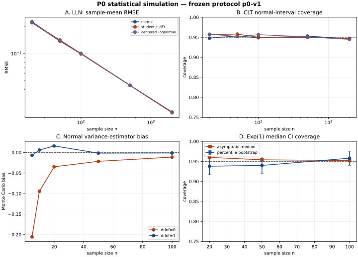

# P0 统计模拟实验：LLN、CLT、区间覆盖率与 Bootstrap

## 问题（Question） {#question}

M01 解释了大数定律（LLN）、中心极限定理（CLT）、方差估计、置信区间和 Bootstrap 的条件与边界。本项目只做一个可恢复的 Monte Carlo 切片：在固定随机种子与固定重复次数下，观察这些结论在有限样本、非正态和重尾/偏态分布下的数值表现，并记录哪些结果只是本次协议的证据。

## 背景与动机（Background & Motivation） {#background}

MIT 18.05 将随机变量、分布、置信区间、假设检验和线性回归组织成概率统计入门主线；Hansen 的概率统计教材把这类内容放在计量经济学之前。[1][2] Efron 的经典论文提出 Bootstrap 方法并讨论其与 jackknife 的关系及多个示例。[3] 本项目据此验证有限样本行为，但不把一次 Monte Carlo 结果写成定理证明。

<div class="evidence"><strong>证据边界：</strong>公开课程/论文支撑方法定义；配置、代码、JSON 结果、SVG 曲线和本报告属于本地证据。所有数值只支持 `p0-v1` 协议下的方向性观察，不支持任何市场收益、因果效果或普适覆盖率承诺。</div>

## 基础概念与术语 {#concepts}

- **Monte Carlo 重复（replication）**：在固定数据生成过程下重复抽样，用重复结果近似估计量的抽样分布。
- **覆盖率（coverage）**：重复构造的区间包含固定真值的比例；它不是本次已计算区间包含参数的后验概率。
- **Monte Carlo 标准误**：若覆盖率估计为 \(\hat c\)，外层重复数为 \(R\)，则 \(\sqrt{\hat c(1-\hat c)/R}\) 描述模拟噪声，不是统计模型的标准误。
- **Bootstrap percentile interval**：从经验分布重采样得到统计量分布，取其经验分位点作为区间端点；依赖数据和小样本时不能自动保证标称覆盖率。[3]

## 方法与项目拆解（Methods） {#methods}

### 冻结协议 {#protocol}

完整协议保存于 [`config.json`](config.json)：

| 项目 | 固定值 |
|---|---|
| protocol version | `p0-v1` |
| seed | `20260722`，使用 `numpy.random.default_rng` |
| LLN/CLT 重复数 | 每个分布、每个样本量 4,000 |
| 样本量 | 20、50、100、500、2,000 |
| 分布 | \(N(0,1)\)、方差标准化的 t(3)、中心化并标准化的 Lognormal(0,1) |
| 方差偏差 | 正态样本，ddof=0 与 ddof=1，样本量 5、10、20、50、100 |
| 正态均值区间 | z 临界值与 Student-t 临界值并列，4,000 次重复 |
| Bootstrap | Exp(1) 中位数，外层 500、每层 400 次重采样，n=20、50、100 |

NumPy 官方文档说明 `default_rng(seed)` 创建基于 Generator/BitGenerator 的随机接口，默认 BitGenerator 为 PCG64；本地结果记录了版本和 seed，但不宣称任意未来版本逐位兼容。[4]

### 数据生成与指标 {#data-generation}

对于三类标准化分布，真均值为 0、真方差为 1。每一组输出：样本均值偏差、RMSE、标准化均值的正态区间覆盖率和到标准正态的 KS 距离。方差实验比较 ddof=0 与 ddof=1 的有限样本偏差。区间实验把真实均值固定为 0。Bootstrap 实验的 Exp(1) 真中位数为 \(\log 2\)，并比较 percentile 区间与已知渐近中位数标准误的区间。

## 数学形式与训练目标（Mathematical Form） {#math}

### LLN 与 CLT 指标 {#lln-clt}

对均值为 \(\mu\)、方差为 \(\sigma^2\) 的样本，模拟记录 \(\bar X_n\) 和：

\[
Z_n=\sqrt n\,\frac{\bar X_n-\mu}{\sigma}.
\]

<div class="note"><strong>变量、直觉与实现映射：</strong>\(n\) 是单次样本量，\(\bar X_n\) 是该次均值，\(Z_n\) 是 CLT 标准化对象。代码中三类分布均先做真均值/方差标准化，再计算 `z = sqrt(n) * means`；大样本时只检查近似行为。</div>

LLN 的方向性指标是均值 RMSE：

\[
\operatorname{RMSE}_n
=\sqrt{\frac1R\sum_{r=1}^{R}(\bar X_{n,r}-\mu)^2}.
\]

<div class="note"><strong>变量、直觉与实现映射：</strong>\(R=4000\) 是外层重复数；RMSE 同时包含有限样本方差和可能的模拟偏差。它随 \(n\) 下降支持本协议下的 LLN 方向，但不是对所有分布条件的证明。</div>

### 覆盖率与模拟误差 {#coverage}

区间覆盖率估计为：

\[
\hat c=\frac1R\sum_{r=1}^{R}\mathbf 1\{L_r\le\theta\le U_r\},
\qquad
\operatorname{MCSE}(\hat c)=\sqrt{\frac{\hat c(1-\hat c)}{R}}.
\]

<div class="note"><strong>变量、直觉与实现映射：</strong>\(L_r,U_r\) 是第 \(r\) 次重复的区间，\(\theta\) 是固定真值；MCSE 只量化 Monte Carlo 重复有限带来的噪声。报告同时保存 coverage 与 MCSE，避免把 0.95 附近的小差异过度解释。</div>

### Bootstrap percentile {#bootstrap}

给定样本 \(x_{1:n}\)，从经验分布重采样得到统计量 \(T_b^*\)，percentile 区间为：

\[
\left[Q_{\alpha/2}(T^*),\;Q_{1-\alpha/2}(T^*)\right].
\]

<div class="note"><strong>变量、直觉与实现映射：</strong>\(B=400\) 是每个外层样本的重采样次数，\(Q_p\) 是经验分位点。代码使用索引矩阵生成 bootstrap 中位数；这个实现保留 iid 重采样假设，不能直接替代金融时间序列的 block bootstrap。</div>

## Pipeline 与伪代码（Pipeline & Pseudocode） {#pipeline}

```python
def run_protocol(config):
    # 1. Freeze the seed and create one Generator for the whole protocol.
    rng = np.random.default_rng(config["seed"])

    # 2. For each distribution and n, draw R samples and compute means/Z/coverage.
    lln_clt = run_lln_clt(config, rng)

    # 3. Compare ddof=0 and ddof=1 variance estimators under known N(0, 1).
    variance_bias = run_variance_bias(config, rng)

    # 4. Compare z and Student-t mean intervals under normal data.
    ci_coverage = run_ci_coverage(config, rng)

    # 5. Bootstrap Exp(1) medians and save percentile coverage/width.
    bootstrap = run_bootstrap_median(config, rng)

    # 6. Persist config, environment, hashes, JSON rows, and a deterministic SVG.
    return {"lln_clt": lln_clt, "variance_bias": variance_bias,
            "ci_coverage_normal": ci_coverage, "bootstrap_median": bootstrap}
```

真实实现见 [`run_experiments.py`](run_experiments.py)；伪代码省略了数组形状和序列化细节，但每一步都能在源码函数中定位。

## 实现证据与结果（Implementation & Results） {#implementation}

### 运行产物 {#artifacts}

- [`summary.json`](results/summary.json)：协议、环境版本、脚本/config SHA 和完整数值结果；
- [`summary.svg`](results/summary.svg)：四面板曲线，渲染到本 HTML 时会内联为 data URI；
- [`validation.json`](results/validation.json)：结果契约检查；
- [`validate_results.py`](validate_results.py)：有限范围的自动验证器；
- [`test_experiments.py`](test_experiments.py)：分布标准化与异常分布负向测试。



### 关键数值摘要 {#summary}

| 实验 | 代表结果 | 本协议下的解释 |
|---|---|---|
| LLN：正态均值 RMSE | n=20 为 0.224761；n=2,000 为 0.022487 | RMSE 随样本量下降，符合本协议下的收敛方向 |
| CLT：n=2,000 覆盖率 | 正态 0.94625；t(3) 0.94675；中心化 Lognormal 0.94475 | 三者接近 0.95，但不证明有限样本普适正态 |
| 方差偏差 | n=5：ddof=0 为 -0.205589，ddof=1 为 -0.006986 | ddof=0 的有限样本向下偏差明显；ddof=1 在本实验中更接近 0 |
| 正态均值区间 | n=10：z 区间 0.916，t 区间 0.94925；n=100：z 0.9475，t 0.95075 | 小样本用 Student-t 临界值在本协议更接近标称覆盖率 |
| Bootstrap Exp(1) 中位数 | percentile 覆盖率：n=20/50/100 为 0.938/0.940/0.958 | 结果接近标称值，但覆盖差异与 MCSE、重采样数和 iid 假设相关 |

### 四面板图的读法 {#plot-reading}

图 A 的横纵轴分别是样本量和均值 RMSE，均为对数尺度；图 B 是正态近似区间覆盖率，虚线为 0.95；图 C 是方差估计偏差，零线代表无偏；图 D 是 Exp(1) 中位数的覆盖率，误差棒为约 1.96 倍 Monte Carlo 标准误。图不是独立证据，完整数值以 JSON 为准。

## 公源/本地设计边界（Evidence Boundary） {#boundary}

| 类别 | 本项目内容 |
|---|---|
| 公有来源 | MIT 18.05、Hansen 概率统计、Efron Bootstrap 论文、NumPy Generator 文档。[1–4] |
| 本地证据 | `config.json`、`run_experiments.py`、`summary.json`、`summary.svg`、`validation.json` 和测试输出。 |
| 本地推断 | 在 `p0-v1` 协议内，对 RMSE、覆盖率、ddof 偏差和 Bootstrap 区间的方向性解释。 |
| 未验证 | 不同随机数实现、更多分布、依赖时间序列、block bootstrap、金融真实数据和生产收益表现。 |

## 方法对比与选择建议 {#comparison}

| 需要回答的问题 | 本实验能做什么 | 不能替代什么 |
|---|---|---|
| LLN/CLT 直觉 | 给出可重复的有限样本轨迹 | 不替代理论条件检查 |
| 区间覆盖率 | 比较 z/t、percentile 在固定 DGP 下的覆盖 | 不保证真实数据或模型选择后的覆盖 |
| Bootstrap | 展示经验分布重采样和 MCSE | 不自动处理时间依赖、结构变化和数据泄漏 |
| 工程复现 | 固定配置、seed、版本、SHA、JSON、SVG | 不保证跨平台/未来版本逐位一致 |

默认建议：先运行 P0 并读懂结果，再进入 M02 的收益、公司行动和数据契约；不要用本实验的 iid 结论直接设计金融时间序列回测。

## 风险与后续建议（Risks & Next） {#risks}

- 外层重复数和 Bootstrap 重采样数有限，覆盖率差异应结合 MCSE 解释。
- t(3) 与 Lognormal 的有限样本行为依赖标准化方式；本实验只固定了一个 DGP。
- 结果验证器检查方向性契约，不是统计证明器；它不能发现所有代码或理论错误。
- 真实金融序列通常有依赖、异方差、厚尾、交易日和修订数据；M04/P1/P2 将把这些问题显式纳入。
- 下一 slice G05/M02 只处理会计、市场机制、收益口径和数据审计，不重复生成本实验。

## 参考文献（References） {#references}

1. [1] Jeremy Orloff and Jonathan Bloom, “18.05 Introduction to Probability and Statistics,” MIT OpenCourseWare, 2022. [链接](https://ocw.mit.edu/courses/18-05-introduction-to-probability-and-statistics-spring-2022/)
2. [2] Bruce E. Hansen, *Probability and Statistics for Economists*, Princeton University Press, 2022. [链接](https://www.ssc.wisc.edu/~bhansen/probability/)
3. [3] Bradley Efron, “Bootstrap Methods: Another Look at the Jackknife,” *The Annals of Statistics*, 1979. [链接](https://projecteuclid.org/journals/annals-of-statistics/volume-7/issue-1/Bootstrap-Methods-Another-Look-at-the-Jackknife/10.1214/aos/1176344552.short)
4. [4] NumPy Developers, “Random Generator,” NumPy Reference, 核验于 2026-07-22. [链接](https://numpy.org/doc/stable/reference/random/generator.html)
