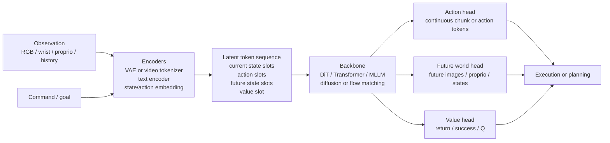
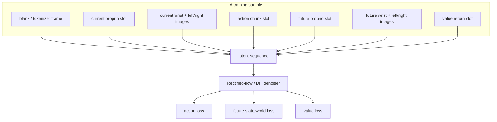
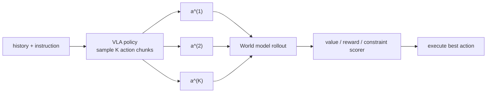
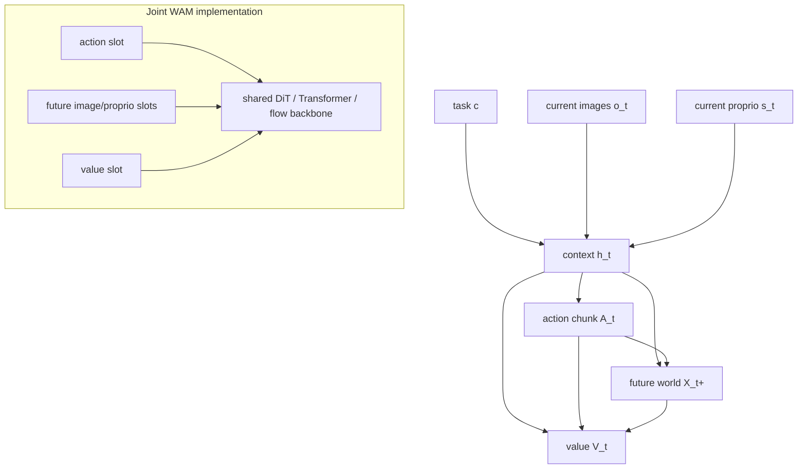
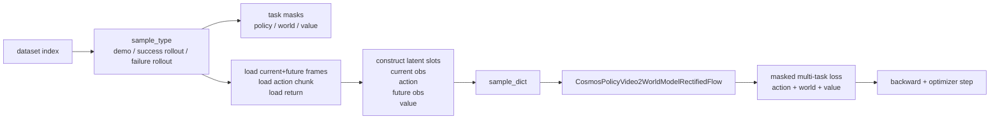
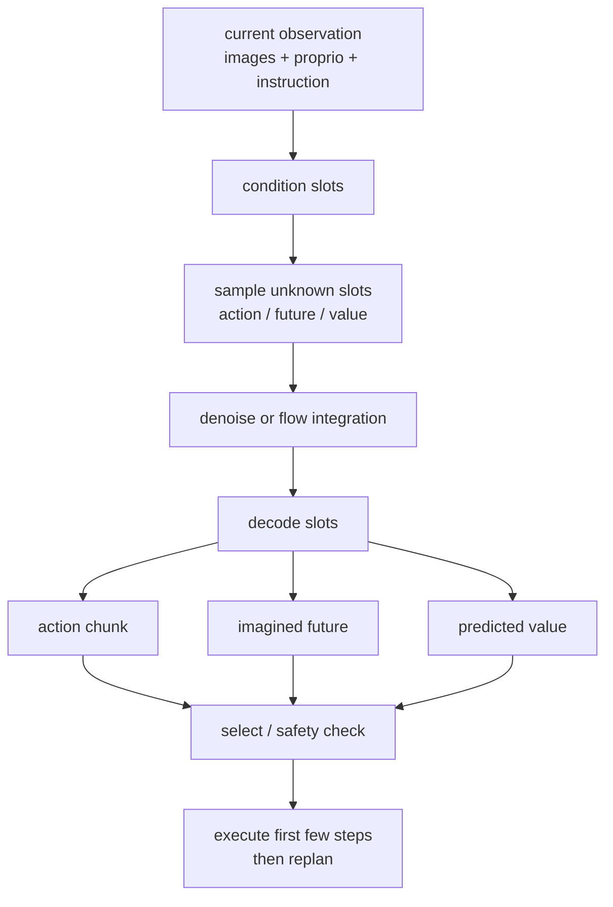
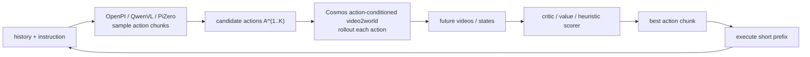
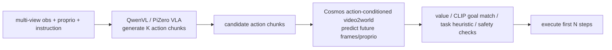

# WAM / World Action Model 调研报告

生成日期：2026-06-13
本地锚点：`C:\Users\mousongzhe\pryer\project`，重点是 `13_dreamdojo_world_model` 与 OpenPI/QwenVL/PiZero VLA 线。

## 0. 一句话结论

WAM, World Action Model, 可以理解为“会行动的世界模型”或“带世界预测的动作模型”：它不只学习

$$
\pi_\theta(a_{t:t+H-1}\mid o_{\le t}, s_t, c)
$$

也不只学习

$$
W_\theta(x_{t+1:t+H}\mid x_{\le t}, a_{t:t+H-1}, c)
$$

而是把动作、未来状态、价值/成功概率放进一个联合生成或联合预测问题里：

$$
p_\theta(a_{t:t+H-1}, x_{t+1:t+H}, v_t \mid h_t, c)
$$

其中 \(h_t\) 是历史观测、机器人状态、历史动作和任务语言的压缩上下文。直观说，VLA 更像“看图听指令后直接动手”，WM 更像“给定动作后想象世界会怎样”，WAM 则尝试在同一个模型中同时回答：“我该怎么动？动完世界会怎样？这个结果值不值得？”

## 1. 外部领域脉络

2026 年 5 月的综述论文 **World Action Models: The Next Frontier in Embodied AI** 明确把 WAM 定义为“integrate state prediction with action generation”的新范式，并把它视为连接世界模型、VLA 与具身智能控制的桥。这个说法还很新，因此目前 WAM 更像一个正在形成的范式名，而不是已经有稳定工程标准的模型家族。

相关主线可以按四层理解：

| 层次 | 代表问题 | 代表模型/项目 | 和 WAM 的关系 |
| --- | --- | --- | --- |
| VLA | 从视觉/语言直接生成动作 | RT-2, OpenVLA, pi0, OpenPI | 提供动作生成能力，但通常不显式生成未来世界 |
| WM / WFM | 根据当前状态和条件生成未来观测 | DreamDojo, Cosmos Predict2.5 | 提供想象/预测能力，但常需外部策略或规划器 |
| Policy + WM + Value | 同一系统同时训练动作、未来和价值 | Cosmos Policy | 非常接近工程意义上的 WAM |
| Object-aware / causal WAM | 绑定对象状态、动作和未来变化 | OA-WAM, RepWAM 等新论文 | 试图解决对象级因果与泛化问题 |

可参考资料：

- WAM 综述：<https://arxiv.org/abs/2605.12090>
- OA-WAM：<https://arxiv.org/abs/2605.06481>
- RepWAM：<https://arxiv.org/abs/2606.13674>
- NVIDIA Cosmos Policy：<https://research.nvidia.com/labs/dir/cosmos-policy/>
- Cosmos Policy GitHub：<https://github.com/NVlabs/cosmos-policy>
- DreamDojo GitHub：<https://github.com/NVIDIA/DreamDojo>
- RT-2：<https://arxiv.org/abs/2307.15818>
- OpenVLA：<https://arxiv.org/abs/2406.09246>
- pi0：<https://arxiv.org/abs/2410.24164>
- FAST action tokenizer：<https://arxiv.org/abs/2501.09747>
- RoboCasa：<https://arxiv.org/abs/2406.02523>

## 2. WM / VLA / WAM 的关键区分

| 维度 | WM, World Model | VLA, Vision-Language-Action | WAM, World Action Model |
| --- | --- | --- | --- |
| 主要条件 | 当前/历史状态、动作、语言 | 当前/历史视觉、语言、机器人状态 | 当前/历史状态、语言，并联合处理动作和未来 |
| 主要输出 | 未来图像/状态/奖励 | 动作或动作块 | 动作、未来状态、价值/成功概率 |
| 数学对象 | \(p(x_{t+1:t+H}\mid h_t,a_{t:t+H-1},c)\) | \(p(a_{t:t+H-1}\mid h_t,c)\) | \(p(a_{t:t+H-1},x_{t+1:t+H},v_t\mid h_t,c)\) |
| 推理方式 | 给动作后 rollout，常外接规划器 | 直接执行或 action chunk 执行 | 生成动作，同时自带想象和评分 |
| 典型失败 | 画面像但动作不可控，rollout 误差累积 | 反应式强但缺少“后果意识” | 多任务损失冲突、世界预测与控制目标互相拉扯 |
| 本地对应 | `13_dreamdojo_world_model` 的 DreamDojo / Cosmos Predict2.5 | `01/03/04/05_openpi_*` QwenVL/PiZero/FAST/FM | `13_dreamdojo_world_model` 中 Cosmos Policy RoboCasa finetune 最像 |

更口语一点：

- WM 是“如果这样做，世界会变成什么样？”
- VLA 是“现在应该做哪个动作？”
- WAM 是“我生成一个动作，同时预测它造成的世界，并估计这个未来是否好。”

## 3. WAM 的典型架构

### 3.1 宏观结构图



### 3.2 Joint WAM, 同一 latent 序列的做法

这一类最像你本地 Cosmos Policy 线。它把“当前观测、当前 proprio、动作块、未来 proprio、未来图像、value return”排列成一个视频/latent 序列。模型本身仍然像 video2world diffusion / rectified-flow 模型，但某些“帧”不再是真实图像，而是动作、状态或价值的占位 latent。



### 3.3 Cascaded WAM, 策略和世界模型分开

另一种常见实现是级联式：VLA 先产生候选动作，WM rollout 这些动作造成的未来，再用 reward/value/critic/规则挑选。



这种方式的优点是工程边界清楚，能复用已有 VLA 和 WM；缺点是慢、误差链长，而且策略和世界模型的表征未必对齐。

## 4. 数学形式

这一节把 WAM 先写成清楚的概率图，再落到扩散 / rectified flow 的训练目标。核心思想是：动作 \(a\)、未来世界 \(x^+\) 和价值 \(v\) 不再是三个孤立模块的输出，而是同一个条件联合分布里的三个随机变量。

### 4.1 轨迹、上下文与槽位变量

机器人数据通常来自一条带语言任务的轨迹：

$$
\tau =
\left(
c,\;
o_{1:T},\;
s_{1:T},\;
a_{1:T-1},\;
r_{1:T},\;
d_{1:T}
\right)
$$

其中 \(c\) 是任务语言，\(o_t\) 是多视角 RGB / wrist 图像，\(s_t\) 是 proprioception，\(a_t\) 是控制动作，\(r_t\) 是奖励，\(d_t\) 是 done / success 标记。给定当前时刻 \(t\) 和 horizon \(H\)，WAM 样本可写成：

$$
x_t =
\left(
h_t,\;
A_t,\;
X^+_t,\;
V_t
\right)
$$

各部分含义是：

$$
h_t = \phi(o_{\le t},s_{\le t},a_{<t},c)
$$

$$
A_t = a_{t:t+H-1}\in\mathbb{R}^{H\times D_a}
$$

$$
X^+_t = (o_{t+H},s_{t+H}) \quad \text{或更细的 } (o_{t+1:t+H},s_{t+1:t+H})
$$

$$
V_t = \sum_{k=0}^{H'}\gamma^k r_{t+k}
$$

如果是 Cosmos Policy / RoboCasa 风格，\(D_a=7\)，\(s_t\in\mathbb{R}^9\)，本地当前配置里 `chunk_size=32`，也就是 \(H=32\)。证据在 `config.yaml` 第 38-51 行：dataset 是 `RoboCasaDataset`，`chunk_size: '32'`，`p_world_model: '0.5'`，`return_value_function_returns: 'True'`，`rollout_data_dir` 指向 `all_episodes`。

Joint WAM 会把这些变量放入一个统一 token / latent 序列：

$$
Y_t =
\left[
y^{blank},
y^{s_t},
y^{o_t,wrist},
y^{o_t,left},
y^{o_t,right},
y^{A_t},
y^{s_{t+H}},
y^{o_{t+H},wrist},
y^{o_{t+H},left},
y^{o_{t+H},right},
y^{V_t}
\right]
$$

这里的 \(y^{A_t}\)、\(y^{s_t}\)、\(y^{V_t}\) 可以不是图像，而是“伪帧”或“latent slot”。本地 `robocasa_dataset.py` 正是这么组织的：第 883 行放 tokenizer blank frame，第 900 行记录 `current_proprio_latent_idx`，第 930 行记录 `action_latent_idx`，第 945/961 行记录 future proprio / future image slot，第 974 行记录 `value_latent_idx`。

### 4.2 三种因子分解：为什么 WAM 不等于简单 VLA + WM

最朴素的 VLA 是：

$$
p_\theta(A_t\mid h_t)
$$

最朴素的动作条件世界模型是：

$$
p_\theta(X^+_t\mid h_t,A_t)
$$

如果把两者串起来，可以得到 cascaded WAM：

$$
p(A_t,X^+_t,V_t\mid h_t)
=
p_\pi(A_t\mid h_t)
p_W(X^+_t\mid h_t,A_t)
p_V(V_t\mid h_t,A_t,X^+_t)
$$

这很好实现，但三个模型的表征可能不一致。Joint WAM 则尝试直接建模：

$$
p_\theta(A_t,X^+_t,V_t\mid h_t)
$$

它也可以自回归分解：

$$
p_\theta(A_t,X^+_t,V_t\mid h_t)
=
p_\theta(A_t\mid h_t)
p_\theta(X^+_t\mid h_t,A_t)
p_\theta(V_t\mid h_t,A_t,X^+_t)
$$

也可以用扩散 / flow 一次性生成所有非条件 slot：

$$
p_\theta(Y^{unknown}_t\mid Y^{cond}_t,c)
$$

其中：

$$
Y^{cond}_t=\{y^{s_t},y^{o_t,*},c\},\quad
Y^{unknown}_t=\{y^{A_t},y^{s_{t+H}},y^{o_{t+H},*},y^{V_t}\}
$$

这就是 WAM 的结构本质：同一个 backbone 同时看到“当前世界”和“要生成的动作/未来/价值槽位”，而不是只在最后接一个动作头。

### 4.3 动作生成的 Flow Matching 目标

本地 OpenPI/QwenVL/PiZero VLA 线使用的是连续动作 flow matching。令真实动作块为：

$$
x_0=A_t
$$

从高斯噪声采样：

$$
x_1=\epsilon,\quad \epsilon\sim\mathcal{N}(0,I)
$$

插值：

$$
x_\tau = (1-\tau)x_0+\tau x_1,\quad \tau\in[0,1]
$$

若使用最简单的 rectified flow，目标速度场是：

$$
u^\star(x_\tau,\tau)=x_1-x_0
$$

本地 PiZero 里实际有一个小修正项 `flow_sig_min`，代码第 2458 行附近对应：

$$
d_\psi=x_1-(1-\sigma_{min})x_0
$$

模型预测：

$$
v_\theta =
f_\theta(x_\tau,\tau,h_t,c)
$$

训练损失：

$$
\mathcal{L}_{act}
=
\mathbb{E}
\left[
\left\|
M_A\odot
\left(
v_\theta-d_\psi
\right)
\right\|_2^2
\right]
$$

其中 \(M_A\) 是 action mask。本地对应 `pizero_qwenvl_fast_fortrainer.py` 第 2455 行 `v_psi = self.action_decoder(...)`，第 2458 行 `d_psi = ...`，第 2461 行 `loss_action = mean((v_psi[action_mask] - d_psi[action_mask]) ** 2)`。

推理时从噪声动作块出发，用数值积分得到动作：

$$
x_{\tau-\Delta\tau}
=
x_\tau-\Delta\tau\cdot v_\theta(x_\tau,\tau,h_t,c)
$$

本地对应 `sample_actions` 第 2651 行进入推理，`infer_action` 第 1464 行开始，Euler / 其他积分器在第 1776 行附近调用 `action_decoder` 得到 `action_vel`。

### 4.4 世界预测的 latent diffusion / rectified-flow 目标

视频世界模型通常先用 VAE / video tokenizer 压缩图像：

$$
z_t=E_\phi(o_t),\quad \hat{o}_t=G_\phi(z_t)
$$

把当前条件帧和未来目标帧写成：

$$
Z^{cond} = E_\phi(o_{\le t}),\quad
Z^{future} = E_\phi(o_{t+H})
$$

动作条件 WM 学：

$$
p_\theta(Z^{future},s_{t+H}\mid Z^{cond},s_t,A_t,c)
$$

如果用 denoising score matching：

$$
Z_\sigma = Z^{future}+\sigma\epsilon
$$

$$
\mathcal{L}_{WM}^{diff}
=
\mathbb{E}_{\sigma,\epsilon}
\left[
w(\sigma)
\left\|
D_\theta(Z_\sigma,\sigma,Z^{cond},A_t,c)-Z^{future}
\right\|_2^2
\right]
$$

如果用 rectified flow，则：

$$
Z_\tau=(1-\tau)Z^{future}+\tau\epsilon,\quad
u_Z^\star=\epsilon-Z^{future}
$$

$$
\mathcal{L}_{WM}^{RF}
=
\mathbb{E}
\left[
\|v_\theta(Z_\tau,\tau,Z^{cond},A_t,c)-u_Z^\star\|_2^2
\right]
$$

本地 `action_conditioned.py` 更像 WM 推理侧：第 302 行取 `actions = data["action"]...`，第 322 行切 `actions_chunk`，第 349 行调用 `video2world_cli.generate_vid2world(... action=actions_chunk ...)`。这说明它使用动作块作为条件生成未来视频，但它本身不直接生成动作。

### 4.5 价值函数、成功概率与回报监督

WAM 比 WM 多一个关键变量：这个未来是否值得执行。最简单的价值目标是 Monte Carlo return：

$$
R_t=\sum_{k=0}^{T-t}\gamma^k r_{t+k}
$$

价值预测：

$$
\hat V_\theta = V_\theta(h_t,A_t,X^+_t)
$$

监督损失：

$$
\mathcal{L}_{value}
=
\mathbb{E}
\left[
M_V
\left(
\hat V_\theta-R_t
\right)^2
\right]
$$

若是二分类成功概率，也可以写成：

$$
\mathcal{L}_{succ}
=
-\mathbb{E}
\left[
y\log p_\theta(success\mid h_t,A_t,X^+_t)
+(1-y)\log(1-p_\theta(success\mid h_t,A_t,X^+_t))
\right]
$$

本地 `robocasa_dataset.py` 第 1030-1038 行从 future timestep 取 `value_function_return`，第 1064 行返回 `value_function_sample_mask`，第 1076 行把 `value_function_return` 放进 sample dict。当前 run 的 `config.yaml` 第 49-50 行把 `p_world_model=0.5` 和 `return_value_function_returns=True` 打开。

### 4.6 Joint WAM 的统一损失

令 slot mask 为：

$$
M_A,\;M_W,\;M_V\in\{0,1\}
$$

分别表示 action、world、value 的监督是否对当前样本生效。Cosmos Policy 风格可以写成：

$$
\mathcal{L}_{WAM}
=
\lambda_A M_A\mathcal{L}_{act}
+\lambda_W M_W\mathcal{L}_{world}
+\lambda_V M_V\mathcal{L}_{value}
+\lambda_C\mathcal{L}_{cons}
$$

本地配置第 177 行有 `action_loss_multiplier: 16`，可理解为 \(\lambda_A=16\) 的工程形式。rollout 样本中：

$$
P(M_W=1)=p_{world}=0.5,\quad
P(M_V=1)=1-p_{world}=0.5
$$

本地代码第 812-823 行就是这个采样逻辑：非 demo 样本如果 `random.random() < self.p_world_model`，则 `is_world_model_sample=True`，否则 `is_value_function_sample=True`。

一致性项不是所有实现都有，但对理解 WAM 很重要：

$$
\mathcal{L}_{cons}
=
d\left(
G_\phi(\hat Z^{future}),
W_\theta(h_t,\hat A_t,c)
\right)
$$

也可以用 dynamics consistency：

$$
\mathcal{L}_{dyn}
=
\left\|
\hat s_{t+H}
-
F_\theta(s_t,\hat A_t)
\right\|_2^2
$$

这类项的意义是让动作生成和世界预测共享同一个物理因果解释：如果模型说这个动作能开抽屉，未来帧 / proprio / value 也必须支持这个说法。

### 4.7 WAM 架构的概率图



这个图的重点是三条边：\(A_t\to X^+_t\)，\(A_t\to V_t\)，\(X^+_t\to V_t\)。纯 VLA 只学 \(H\to A\)，纯 WM 只学 \(H,A\to X^+\)，WAM 则把这三者放在同一张图里。

## 5. 典型算法伪代码

这里把 5.1 / 5.2 / 5.3 拆成“图、伪代码、代码映射、注释”。你可以把它当作读本地代码的路线图。

### 5.1 Joint WAM 训练

#### 5.1.1 可视化架构



#### 5.1.2 带注释伪代码

```python
for idx in sampler:
    # 1) 数据集先决定样本来源。
    # demo: 成功演示，主要用于学好动作。
    # success_rollout/failure_rollout: 成功或失败 rollout，用于学世界模型和价值。
    sample_type = determine_sample_type(
        idx,
        adjusted_demo_count,
        adjusted_success_rollout_count,
    )

    # 2) 对 rollout 样本再抽一个任务类型。
    # p_world_model=0.5 时，一半 rollout 样本训练 future/world，
    # 另一半训练 value/return。
    if sample_type != "demo":
        if random() < p_world_model:
            world_model_sample_mask = 1
            value_function_sample_mask = 0
        else:
            world_model_sample_mask = 0
            value_function_sample_mask = 1

    # 3) 从同一条轨迹切出当前时刻、未来时刻和动作块。
    current_frame = images[t]
    future_frame = images[min(t + chunk_size, T - 1)]
    action_chunk = actions[t : t + chunk_size]
    value_return = returns[min(t + chunk_size, T - 1)]

    # 4) 构造 WAM 的 slot 序列。
    # 注意 action/proprio/value 在数据集里先以 blank image 占位，
    # 后续模型侧再根据 idx 把真实数值注入 latent slot。
    slots = [
        blank_tokenizer_frame,
        current_proprio_slot,
        current_wrist_image,
        current_left_image,
        current_right_image,
        action_chunk_slot,
        future_proprio_slot,
        future_wrist_image,
        future_left_image,
        future_right_image,
        value_return_slot,
    ]

    batch = {
        "video": preprocess(slots),
        "actions": action_chunk,
        "proprio": current_proprio,
        "future_proprio": future_proprio,
        "value_function_return": value_return,
        "action_latent_idx": action_slot_index,
        "future_image_latent_idx": future_image_slot_index,
        "value_latent_idx": value_slot_index,
        "world_model_sample_mask": world_model_sample_mask,
        "value_function_sample_mask": value_function_sample_mask,
    }

    # 5) 模型侧：把 video token 化为 latent，在指定 slot 注入 action/proprio/value。
    # 训练目标是 rectified-flow / diffusion denoising。
    z0 = tokenizer.encode(batch["video"])
    z0[action_idx] = action_embed(batch["actions"])
    z0[current_proprio_idx] = proprio_embed(batch["proprio"])
    z0[future_proprio_idx] = proprio_embed(batch["future_proprio"])
    z0[value_idx] = value_embed(batch["value_function_return"])

    tau = sample_time()
    eps = randn_like(z0)
    z_tau = (1 - tau) * z0 + tau * eps
    target_velocity = eps - z0

    pred_velocity = model(z_tau, tau, text=batch["t5_text_embeddings"])

    # 6) 不同 slot 用不同 mask 算 loss。
    loss_action = mse(pred_velocity[action_idx], target_velocity[action_idx])
    loss_world = mse(pred_velocity[future_slots], target_velocity[future_slots])
    loss_value = mse(value_head(pred_velocity[value_idx]), batch["value_function_return"])

    loss = (
        lambda_action * policy_mask * loss_action
        + lambda_world * batch["world_model_sample_mask"] * loss_world
        + lambda_value * batch["value_function_sample_mask"] * loss_value
    )
    loss.backward()
    optimizer.step()
```

#### 5.1.3 每一步对应的本地代码

| 伪代码环节 | 本地代码位置 | 实际作用 |
| --- | --- | --- |
| `sample_type = determine_sample_type(...)` | `robocasa_dataset.py:710` 进入 `__getitem__`，`737` 调 `determine_sample_type` | 把一个 index 映射到 demo / success rollout / failure rollout |
| `rollout_data_mask` / `rollout_data_success_mask` | `robocasa_dataset.py:739-740` | 标注样本是不是 rollout，以及是不是成功 rollout |
| `random() < p_world_model` | `robocasa_dataset.py:812-823` | 对 rollout 样本随机指定 world model 监督或 value 监督 |
| `future_frame_idx = t + chunk_size` | `robocasa_dataset.py:826-829` | 决定未来帧 / future proprio / value return 读取位置 |
| `blank_tokenizer_frame` | `robocasa_dataset.py:883-885` | 第一个 blank frame 主要服务 video tokenizer 的序列格式 |
| `current_proprio_slot` | `robocasa_dataset.py:890-901` | 取当前 proprio，并记录 `current_proprio_latent_idx` |
| `action_chunk_slot` | `robocasa_dataset.py:926-931` | 给动作块放一个 blank slot，并记录 `action_latent_idx` |
| `future_proprio_slot` | `robocasa_dataset.py:934-946` | 取未来 proprio，并记录 `future_proprio_latent_idx` |
| `future image slots` | `robocasa_dataset.py:949-966` | 取未来 wrist / left / right 图像，并记录 future image indices |
| `value_return_slot` | `robocasa_dataset.py:970-975` | 给 value 放一个 blank slot，并记录 `value_latent_idx` |
| `action_chunk = actions[t:t+H]` | `robocasa_dataset.py:1008-1027` | 截取动作块，不足 horizon 时重复最后一个 action padding |
| `value_function_return` | `robocasa_dataset.py:1030-1038` | 在 future timestep 读取 return 作为 value target |
| `sample_dict` | `robocasa_dataset.py:1042-1079` | 把 video、actions、proprio、future_proprio、mask、slot index 全部交给模型 |
| 当前训练配置 | `config.yaml:38-51`，`175-177` | 使用 `RoboCasaDataset`，`chunk_size=32`，`p_world_model=0.5`，模型类是 `CosmosPolicyVideo2WorldModelRectifiedFlow`，`action_loss_multiplier=16` |

#### 5.1.4 读代码时要抓住的关键点

`robocasa_dataset.py` 的核心不是普通 dataloader，而是“WAM 样本编排器”。它做三件事：

1. 把数据源分成 demo / success rollout / failure rollout；
2. 把 rollout 样本分成 world model 任务和 value 任务；
3. 把 action、future、value 都变成统一 video latent 序列里的 slot。

所以当你看到 `blank_image` 时，不要理解为“丢信息”；它是在占位。真正的数值信息通过 `action_latent_idx`、`future_proprio_latent_idx`、`value_latent_idx` 等索引，在模型侧注入到对应 latent 位置。

### 5.2 Joint WAM 推理：采样、想象、评分、执行

#### 5.2.1 可视化架构



#### 5.2.2 带注释伪代码

```python
def joint_wam_act(obs, proprio, instruction, K=8):
    # 1) 构造条件 slot。
    # 当前图像、当前 proprio、语言任务是已知条件。
    cond_slots = build_current_slots(obs, proprio, instruction)

    candidates = []
    for k in range(K):
        # 2) 对未知 slot 采样噪声：动作、未来图像/proprio、value。
        # 如果模型是 rectified flow，这些噪声会被积分成数据样本。
        unknown_slots = {
            "action": randn(action_shape),
            "future": randn(future_latent_shape),
            "value": randn(value_shape),
        }

        # 3) 反向扩散 / flow integration。
        # 这里的 model 与训练时共享 backbone。
        # 它不是只输出 action，而是同时更新 action/future/value slot。
        latent = integrate_flow(
            model=model,
            condition=cond_slots,
            unknown=unknown_slots,
            text=instruction,
            steps=N,
        )

        # 4) 解码不同 slot。
        action_chunk = decode_action(latent["action"])
        future_obs = video_decoder(latent["future"])
        value = decode_value(latent["value"])

        # 5) 评分。value 是模型内生评分，constraint_score 是外部安全/任务约束。
        score = value + constraint_score(future_obs, action_chunk, instruction)
        candidates.append((score, action_chunk, future_obs, value))

    # 6) 只执行 action chunk 前几步，然后重新观测、重新规划。
    # 这样能降低 rollout error 累积。
    best = max(candidates, key=lambda item: item[0])
    return best.action_chunk[:execution_horizon]
```

#### 5.2.3 和本地代码的关系

目前本地 evidence 里保留最完整的是 dataset / config / action-conditioned inference。完整 `CosmosPolicyVideo2WorldModelRectifiedFlow` 模型文件没有在整理目录中一比一展开，因此上面第 2-4 步是从配置和数据契约推断的模型侧逻辑，而不是逐行复述本地模型文件。

能在本地直接对应的部分是：

| 推理环节 | 本地代码位置 | 说明 |
| --- | --- | --- |
| 条件构造和 slot contract | `robocasa_dataset.py:1042-1079` | 训练时已经定义了模型输入需要哪些 slot、mask 和 index |
| 当前 run 的模型类 | `config.yaml:175` | `CosmosPolicyVideo2WorldModelRectifiedFlow`，说明模型侧是 video2world + rectified flow 风格 |
| action 权重 | `config.yaml:177` | `action_loss_multiplier: 16`，说明动作监督在联合训练中被明显加权 |
| 执行时 receding horizon 思想 | `action_conditioned.py:320-349` | 按 `chunk_size` 切动作块，逐块调用生成模型并用最后一帧继续滚动 |

#### 5.2.4 为什么要 K 个候选

WAM 的输出通常是多模态的：同一个任务可以有不同可行动作。因此推理时不应只取一个 deterministic action。更稳的做法是：

$$
\{A_t^{(k)},X_t^{+(k)},V_t^{(k)}\}_{k=1}^{K}
\sim
p_\theta(A_t,X^+_t,V_t\mid h_t,c)
$$

然后选择：

$$
k^\star
=
\arg\max_k
\left[
V_t^{(k)}
-\alpha C_{safety}(A_t^{(k)},X_t^{+(k)})
+\beta S_{goal}(X_t^{+(k)},c)
\right]
$$

其中 \(C_{safety}\) 是碰撞、越界、动作幅度等约束，\(S_{goal}\) 是目标匹配得分。这个选择过程让 WAM 比普通 VLA 更适合长程任务：它不仅问“动作像不像训练数据”，还问“这个动作造成的未来是否满足目标”。

### 5.3 Cascaded WAM 推理

#### 5.3.1 可视化架构



#### 5.3.2 带注释伪代码

```python
def cascaded_wam_step(observation, instruction, K=8):
    # 1) VLA 只负责提出动作候选。
    # 本地对应 OpenPI/QwenVL/PiZero 的 sample_actions。
    action_chunks = []
    for k in range(K):
        action = vla.sample_actions(
            observation=observation,
            prompt=instruction,
            stochastic=True,
        )
        action_chunks.append(action)

    scored = []
    for action in action_chunks:
        # 2) WM 给每个动作候选做未来想象。
        # 本地 action_conditioned.py 是这一路线的直接证据：
        # 它把 actions_chunk 传给 generate_vid2world。
        future_video = world_model.rollout(
            current_image=observation.image,
            action_chunk=action,
            instruction=instruction,
        )

        # 3) 用 value / heuristic / safety 对想象结果打分。
        # 如果没有训练好的 value head，可以先用任务启发式或外部 reward model。
        value = scorer(future_video, action, instruction)
        scored.append((value, action, future_video))

    # 4) 执行最高分动作的一小段，而不是整个 chunk。
    # 真实机器人里通常执行 1-4 步后重新观测。
    best_value, best_action, imagined = max(scored, key=lambda x: x[0])
    return best_action[:execution_horizon]
```

#### 5.3.3 每一步对应的本地代码

| 伪代码环节 | 本地代码位置 | 实际作用 |
| --- | --- | --- |
| `vla.sample_actions(...)` | `pizero_qwenvl_fast_fortrainer.py:2651` | 本地 QwenVL/PiZero VLA 的推理入口，输入 observation + prompt，输出动作块 |
| VLA 动作 flow loss | `pizero_qwenvl_fast_fortrainer.py:2455-2461` | 训练动作速度场，`action_decoder` 输出 \(v_\psi\)，与目标速度 \(d_\psi\) 做 MSE |
| VLA 积分生成动作 | `pizero_qwenvl_fast_fortrainer.py:1464`，`1776-1783` | `infer_action` 中通过积分器和 `action_decoder` 从噪声动作得到 action chunk |
| `actions = data["action"]...` | `action_conditioned.py:302` | 从 dataset 中读取动作序列 |
| `actions_chunk = actions[i:i+chunk_size]` | `action_conditioned.py:322-323` | 把长动作序列切成固定 horizon 的 chunk |
| `generate_vid2world(... action=...)` | `action_conditioned.py:349-357` | 将动作块作为条件输入 Cosmos video2world，生成未来视频 |
| receding rollout | `action_conditioned.py:366-368` | 取生成视频最后一帧作为下一轮输入，实现滚动预测 |

#### 5.3.4 Cascaded 和 Joint 的区别

Cascaded WAM 的数学形式是：

$$
A^{(k)}\sim \pi_\psi(A\mid h_t,c)
$$

$$
X^{+(k)}\sim W_\theta(X^+\mid h_t,A^{(k)},c)
$$

$$
k^\star=\arg\max_k Q_\omega(h_t,A^{(k)},X^{+(k)},c)
$$

Joint WAM 则是：

$$
(A^{(k)},X^{+(k)},V^{(k)})
\sim
p_\theta(A,X^+,V\mid h_t,c)
$$

前者容易落地，因为你本地已经有 VLA 和 action-conditioned WM 两条线；后者更优雅，因为 action、future、value 共享模型内部表征，但训练和调参难度更高。

### 5.4 读 5.1 / 5.2 / 5.3 的最短路径

如果你想按代码理解 WAM，建议按这个顺序读：

1. 先读 `robocasa_dataset.py:710-1079`，理解一个 WAM sample 如何从轨迹变成 slot 序列。
2. 再读 `config.yaml:38-51` 和 `175-177`，理解当前训练把 dataset、model、action loss 权重怎样接起来。
3. 再读 `pizero_qwenvl_fast_fortrainer.py:2455-2461`，理解本地 VLA 的 action flow loss。
4. 再读 `pizero_qwenvl_fast_fortrainer.py:2651` 和 `1464/1776` 附近，理解 VLA 如何在推理时采样动作。
5. 最后读 `action_conditioned.py:302-357`，理解如何把一个动作块交给 Cosmos video2world 去想象未来。

把这五段合起来，你就能看到：本地已有一个 cascaded WAM 的拼图，也已有 Cosmos Policy 风格 joint WAM 的数据/配置雏形。

## 6. 和本地 `pryer` 项目的对应关系

### 6.1 `13_dreamdojo_world_model` 是 WM 主线，但已经接近 WAM

本地 `C:\Users\mousongzhe\pryer\project\13_dreamdojo_world_model\README.md` 对这条线的定位很清楚：

- 这是 2026-04-16 新增的独立“机器人世界模型”主线，不属于 OpenPI 或 VERL。
- 任务链包括 LAM 训练、DreamDojo 预训练、DreamDojo 后训练、教师到学生蒸馏、离线评估、真机/交互式推理。
- 2026-05-21 后，活跃重心从 DreamDojo 快照转向 Cosmos Predict2.5 / Cosmos Policy RoboCasa finetune，以及 VGG-T / DA3 / LIBERO 辅助 pipeline。

从 WAM 角度看：

- DreamDojo 是“世界模型 + 潜在动作”的上游范式，更偏 WM。
- Cosmos Predict2.5 action-conditioned video2world 是“给动作预测未来”的 WM。
- Cosmos Policy RoboCasa finetune 把 policy/world/value 放到同一训练配置里，最接近 WAM。

### 6.2 Cosmos Policy 本地配置的 WAM 信号

本地证据：

`C:\Users\mousongzhe\pryer\project\13_dreamdojo_world_model\04_remote_progress_20260521\README.md`

核心配置：

- experiment：`cosmos_predict2p5_2b_480p_robocasa_50_demos_per_task_no_s3`
- base checkpoint：Cosmos Predict2.5 2B video2world
- dataset：`success_only`
- rollout data：`all_episodes`
- batch size：25
- chunk size：32
- action dim：7
- proprio dim：9
- `p_world_model=0.5`
- `action_loss_multiplier=16`
- model：`CosmosPolicyVideo2WorldModelRectifiedFlow`

这不是普通 VLA 配置，因为它显式同时关心：

1. success demonstrations 上的高质量动作生成；
2. all rollouts 上的世界模型训练；
3. value function returns；
4. future image / future proprio / action latent / value latent 的统一索引。

### 6.3 RoboCasa dataset 的 latent slot 设计

本地代码：

`C:\Users\mousongzhe\pryer\project\13_dreamdojo_world_model\04_remote_progress_20260521\evidence\code\cosmos-policy\cosmos_policy\datasets\robocasa_dataset.py`

关键行为：

- `__getitem__` 先判断样本来自 demo、success rollout 还是 failure rollout。
- rollout 样本再按 `p_world_model` 随机分成 world model sample 或 value function sample。
- 构造图像序列时，会加入 blank slot，后续由模型/latent 逻辑注入 proprio、action、future proprio、future image、value。
- 返回字典里带有 `world_model_sample_mask`、`value_function_sample_mask`、`action_latent_idx`、`future_proprio_latent_idx`、`future_image_latent_idx`、`value_latent_idx` 等字段。

这套数据结构是本地最像 WAM 的地方。它把动作、未来世界和价值变成同一个模型里的不同 latent 位置，而不是三个松散模型。

### 6.4 `action_conditioned.py` 仍是 WM 推理侧

本地代码：

`C:\Users\mousongzhe\pryer\project\13_dreamdojo_world_model\01_pretraining_and_posttraining\cosmos_predict2\action_conditioned.py`

它做的是：

- 从 robot states 中计算相对 action 序列；
- 对 action 做缩放；
- 调 `Video2WorldInference.generate_vid2world(..., action=actions_chunk, ...)`；
- 输出 action-conditioned future video。

这属于“给动作预测未来”的 WM 推理接口。它本身不是完整 WAM，但可以作为 WAM 的 imagination/world rollout 部件。

### 6.5 OpenPI/QwenVL/PiZero 是强 VLA，对 WAM 是 action generator

本地 VLA 主线在：

- `C:\Users\mousongzhe\pryer\project\01_openpi_ace_vla_pretraining`
- `C:\Users\mousongzhe\pryer\project\03_openpi_qwen3_hf_trainer`
- `C:\Users\mousongzhe\pryer\project\04_openpi_fast_zhi_training`
- `C:\Users\mousongzhe\pryer\project\05_openpi_iql_training`

关键特征：

- `PiZero` 里有 `joint_model.mixtures.vlm / fastobs / action`。
- action 主路径是 flow matching 连续动作块，不是纯语言 token。
- FAST action token 是辅助 CE 或 fast-only 路径。
- 训练脚本里把 action loss、FAST CE、VLM loss 做联合训练。
- IQL 线尝试引入 value/advantage，但现有证据里 `final_loss = policy_loss + policy_loss`，说明 value loss 没真正进入最终 loss，是一个需要修复的风险点。

和 WAM 的关系：

- 这是优秀的 action generator / VLA policy。
- 若单独使用，它仍主要是 \(p(a\mid h,c)\)。
- 若接 Cosmos WM rollout 和 value scorer，就能形成 cascaded WAM。
- 若把 action、future、value 融入同一个 latent 序列训练，就变成 joint WAM。

## 7. 一个面向本地项目的 WAM 组合方案

### 7.1 低风险：Cascaded WAM



训练成本较低，因为可以复用已有 VLA 和 WM；但推理慢，并且需要解决动作空间、归一化、时间尺度和数据 schema 对齐。

### 7.2 中风险：Cosmos Policy 风格 Joint WAM

直接沿用 RoboCasa dataset 的做法：

```text
[blank]
[current proprio]
[current wrist image]
[current left image]
[current right image]
[action chunk]
[future proprio]
[future wrist image]
[future left image]
[future right image]
[value return]
```

然后用 rectified-flow / diffusion DiT 统一训练 action、future 和 value。这个方向更“正统 WAM”，但工程成本高，模型和数据集都要严格统一。

### 7.3 高风险：Object-aware WAM

引入对象 slot / 3D slot：

$$
z_t = \{z_t^{robot}, z_t^{obj_1}, \ldots, z_t^{obj_N}, z_t^{scene}\}
$$

动作生成和未来预测都在对象级状态上建模：

$$
p_\theta(a_{t:t+H-1}, z_{t+H}^{1:N}\mid z_t^{1:N}, c)
$$

这个方向能解决“画面像但因果不对”的问题，适合复杂操作、遮挡和对象交互，但本地需要更强的 object/3D perception pipeline。你当前 VGG-T / DA3 / VGGT-Omega action regression 辅助线可以成为这个方向的几何感知基础。

## 8. 宏观领域特征

1. 从 reactive policy 走向 predictive policy
   VLA 解决“怎么动”，WAM 追问“动完会发生什么”。这对长程任务、可逆性、安全约束和多步规划很关键。

2. 从动作 token 到连续 action flow
   RT-2 / FAST 等路线把动作语言化，pi0 / OpenPI / 本地 QwenVL-PiZero 更偏连续 flow matching。WAM 两者都能接，但对真实机器人来说连续动作流更自然。

3. 从像素世界模型到 latent/video foundation model
   大多数新方法不直接在像素上建模，而是用 VAE/video tokenizer/DiT 在 latent 中预测未来。Cosmos Predict2.5 和 DreamDojo 都在这个趋势里。

4. 从演示数据到 rollout 数据
   单靠 success demos 容易得到 imitation policy；WAM 需要 success/failure rollout 来训练 value 和世界模型。你本地 `success_only` + `all_episodes` 的划分正是这个方向。

5. 从单任务 loss 到 mask-controlled multi-task loss
   WAM 的难点不是“多加几个头”，而是不同样本、不同 latent slot、不同目标之间如何 mask、加权、采样，避免梯度冲突。

6. 从图像相似到任务有效性评估
   世界模型的 FVD/PSNR/LPIPS 不够；WAM 必须看 success rate、value calibration、action plausibility、closed-loop recovery 和安全约束。

## 9. 典型风险

| 风险 | 表现 | 应对 |
| --- | --- | --- |
| future looks good, action unusable | 生成视频合理，但动作无法执行 | action normalization、控制频率、robot state 对齐必须严格 |
| compounding error | 多步 rollout 越滚越假 | receding horizon、short chunk、closed-loop replanning |
| loss conflict | action loss 降，future/value 不稳，或反之 | mask、loss weight、梯度监控、分阶段训练 |
| value hallucination | value 高但真实成功率低 | rollout calibration、failure data、offline-to-online 验证 |
| object causality weak | 物体位置变化不符合动作因果 | object slots、3D features、contact-aware data |
| sim-to-real | 仿真里可行，真机失败 | domain randomization、real rollout fine-tune、视觉/动作延迟补偿 |

## 10. 推荐阅读本地代码顺序

1. `C:\Users\mousongzhe\pryer\project\13_dreamdojo_world_model\README.md`
2. `C:\Users\mousongzhe\pryer\project\13_dreamdojo_world_model\04_remote_progress_20260521\README.md`
3. `C:\Users\mousongzhe\pryer\project\13_dreamdojo_world_model\04_remote_progress_20260521\evidence\code\cosmos-policy\cosmos_policy\datasets\robocasa_dataset.py`
4. `C:\Users\mousongzhe\pryer\project\13_dreamdojo_world_model\01_pretraining_and_posttraining\cosmos_predict2\action_conditioned.py`
5. `C:\Users\mousongzhe\pryer\project\03_openpi_qwen3_hf_trainer\qwenvl\pizero_qwenvl_fast_fortrainer.py`
6. `C:\Users\mousongzhe\pryer\project\01_openpi_ace_vla_pretraining\scripts\train_acebrain.py`

读完这些，你会看到三条线的拼图：

- OpenPI/QwenVL/PiZero：强 action generator。
- Cosmos Predict2.5 / DreamDojo：强 video/world generator。
- Cosmos Policy RoboCasa：把 action、future、value 放到同一训练过程的 WAM 雏形。

## 11. 最后的小模型

如果只记一个 mental model，可以记这个：

```text
VLA = policy(action | now)
WM  = imagination(future | now, action)
WAM = joint_model(action, future, value | now)
```

更工程一点：

```text
VLA 关心 action slot。
WM 关心 future slot。
WAM 同时关心 action slot + future slot + value slot，
并要求它们在同一个任务语义和物理因果下自洽。
```
